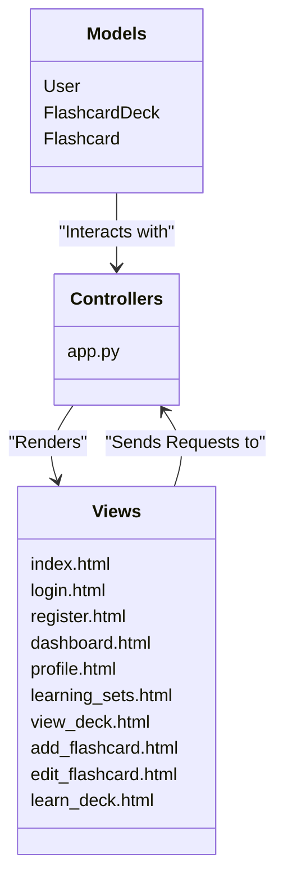
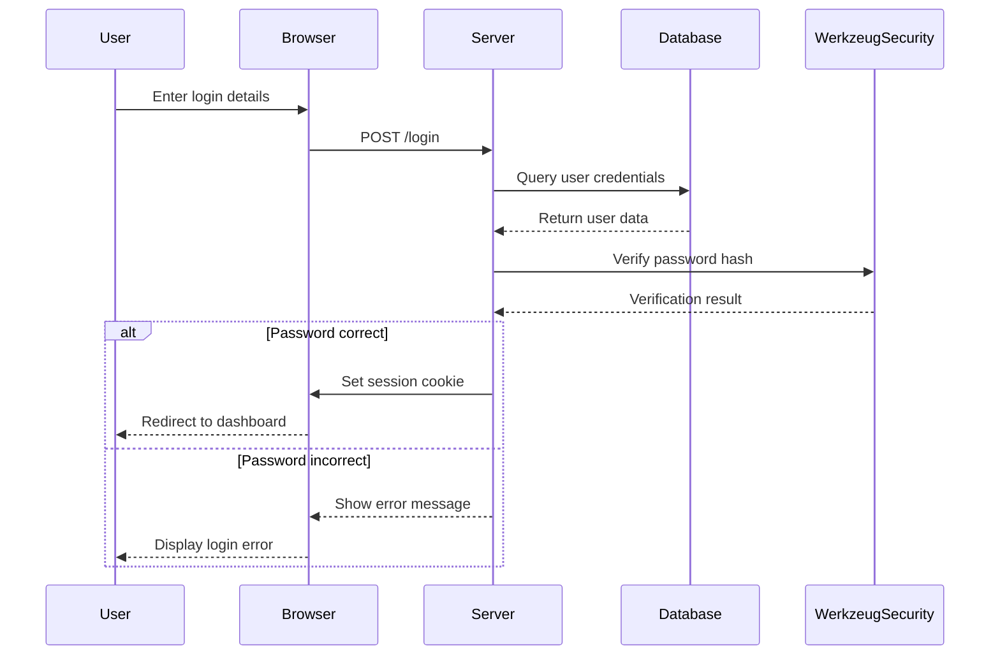
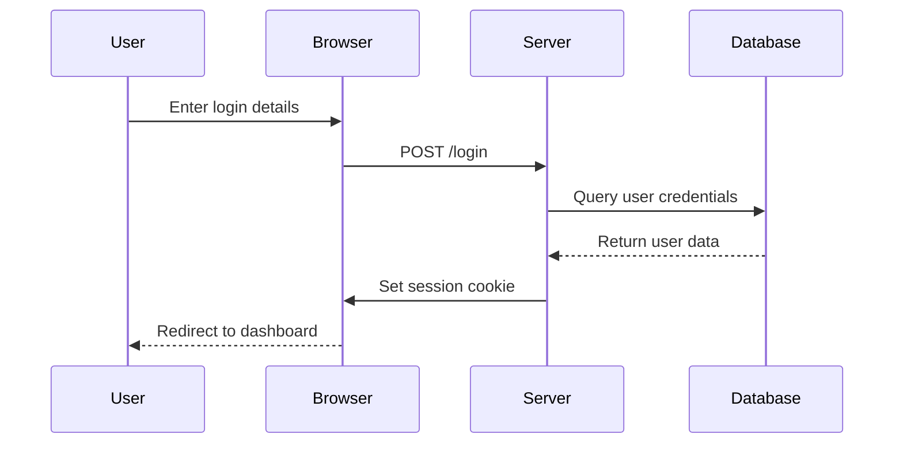
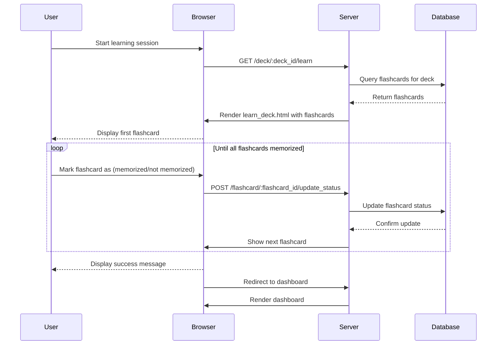

{: .label }
Nadir Tabouni

{: .no_toc }
# Architecture

{: .text-delta }

Table of contents

+ ToC
{: toc }

## Overview
Our application is a web-based flashcard management and learning system. It is designed to allow users to create, manage, and learn from custom flashcard decks. The core functionality includes user authentication, deck creation, flashcard creation, and a learning mode that utilizes spaced repetition principles to optimize memorization.

The application is built using the Flask framework for the backend and leverages SQLAlchemy for database interactions. The frontend uses HTML, CSS, and Jinja2 templating engine to render dynamic content.

Key Features:

+ User Authentication: 
  + Users can register, log in, and log out. Passwords are securely hashed using the Werkzeug security library. 
+ Flashcard Deck Management: 
  + Users can create, edit, and delete flashcard decks. Each deck can contain multiple flashcards. 
+ Flashcard Management:
  + Users can add, edit, and delete individual flashcards within a deck. 
+ Learning Mode: 
  + Users can engage in a learning session where flashcards are presented in a shuffled order. Users can mark flashcards as "memorized" or "not memorized," and cards are repeated until all are marked as memorized. 
+ Search and Browse: 
  + Users can search and browse through all available flashcard decks.

## Codemap

The application architecture follows the Model-View-Controller (MVC) pattern. The Model represents the data logic, the View is the presentation layer, and the Controller handles user input and interacts with the Model to update the View. 

The following MVC diagram provides a visual representation of how the application is structured:

Understanding the directory structure is crucial for navigating and contributing to the project efficiently. The directory structure provides a clear organization of the different components of the application

- lumen 
  - templates 
    - index.html 
    - login.html 
    - register.html 
    - dashboard.html 
    - profile.html 
    - learning_sets.html 
    - view_deck.html 
    - add_flashcard.html 
    - edit_flashcard.html 
    - learn_deck.html
  - static 
    - styles.css 
  - migrations
    - lumenDB.sqlite
  - app.py
  - models.py

## Cross-cutting concerns

### Security Measures
Security is a critical aspect of our application to protect user data and maintain user trust.

The application implements several security measures:

+ Password Hashing: 
  + Passwords are hashed using the werkzeug.security library before being stored in the database. This ensures that passwords are not stored in plain text, providing a layer of security against potential breaches.
+ Session Management: 
  + User sessions are managed using Flask's session management. When a user logs in, a session is created and maintained, which expires after a certain period to prevent unauthorized access. This ensures that only authenticated users can access specific parts of the application.

The following sequence diagram illustrates the password hashing and verification process during user login. It shows how the entered password is verified against the stored hash using the Werkzeug security library. Depending on the verification result, the user is either logged in or shown an error message.

### Error Handling

Error handling is crucial for providing a robust user experience and maintaining the stability of the application. 

Our approach to error handling includes:
+ User-friendly Error Pages: 
  + Custom error pages are created to handle common HTTP errors such as 404 (Not Found) and 500 (Internal Server Error). 
  + These pages provide helpful information to the user without exposing sensitive details about the application.

### Logging
Logging is implemented to track significant events and errors within the application. This is essential for debugging and monitoring the application's performance. Logs are stored in a file and include details such as timestamps, error messages, and the context of the error.

### User Login

The following sequence diagram illustrates the process of user login and the interactions between different components of the application.

### Learning Mode
The following sequence diagram illustrates the learning session process, showing how flashcards are presented and reviewed by the user.

[Describe anything that is important for a solid understanding of your codebase. Most likely, you want to explain the behavior of (parts of) your application. In this section, you may also link to important [design decisions](../design-decisions.md).]
