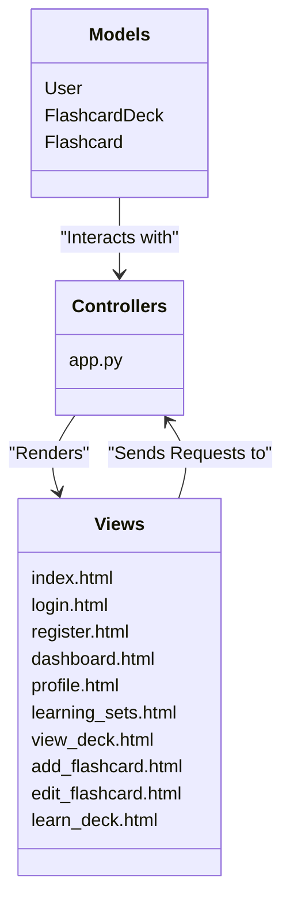

{: .label }
Nadir Tabouni

{: .no_toc }
# Architecture

{: .attention }
> This page describes how the application is structured and how important parts of the app work. It should give a new-joiner sufficient technical knowledge for contributing to the codebase.
> 
> See [this blog post](https://matklad.github.io/2021/02/06/ARCHITECTURE.md.html) for an explanation of the concept and these examples:
>
> + <https://github.com/rust-lang/rust-analyzer/blob/master/docs/dev/architecture.md>
> + <https://github.com/Uriopass/Egregoria/blob/master/ARCHITECTURE.md>
> + <https://github.com/davish/obsidian-full-calendar/blob/main/src/README.md>
> 
> For structural and behavioral illustration, you might want to leverage [Mermaid](../ui-components.md), e.g., by charting common [C4](https://c4model.com/) or [UML](https://www.omg.org/spec/UML) diagrams.
> 
>
> You may delete this `attention` box.

<details open markdown="block">
{: .text-delta }
<summary>Table of contents</summary>
+ ToC
{: toc }
</details>

## Overview
Our application is a web-based flashcard management and learning system. It is designed to allow users to create, manage, and learn from custom flashcard decks. The core functionality includes user authentication, deck creation, flashcard creation, and a learning mode that utilizes spaced repetition principles to optimize memorization.

The application is built using the Flask framework for the backend and leverages SQLAlchemy for database interactions. The frontend uses HTML, CSS, and Jinja2 templating engine to render dynamic content.

Key Features:

+ User Authentication: 
  + Users can register, log in, and log out. Passwords are securely hashed using the Werkzeug security library. 
+ Flashcard Deck Management: 
  + Users can create, edit, and delete flashcard decks. Each deck can contain multiple flashcards. 
+ Flashcard Management:
  + Users can add, edit, and delete individual flashcards within a deck. 
+ Learning Mode: 
  + Users can engage in a learning session where flashcards are presented in a shuffled order. Users can mark flashcards as "memorized" or "not memorized," and cards are repeated until all are marked as memorized. 
+ Search and Browse: 
  + Users can search and browse through all available flashcard decks.


## Codemap

The application architecture follows the Model-View-Controller (MVC) pattern. The Model represents the data logic, the View is the presentation layer, and the Controller handles user input and interacts with the Model to update the View. 

The following MVC diagram provides a visual representation of how the application is structured:


To better understand the organization of our application's directory, here is a visual representation of the app structure in the form of a mindmap.

```mermaid
mindmap
root((Lumen))
templates
index.html
login.html
register.html
dashboard.html
profile.html
learning_sets.html
view_deck.html
add_flashcard.html
edit_flashcard.html
learn_deck.html
static
styles.css
migrations
lumenDB.sqlite
app.py
models.py
requirements.txt
README.md
```

## Cross-cutting concerns

[Describe anything that is important for a solid understanding of your codebase. Most likely, you want to explain the behavior of (parts of) your application. In this section, you may also link to important [design decisions](../design-decisions.md).]
