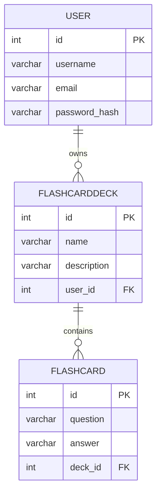

{: .label }
Cennet Kurnaz

{: .no_toc }
# Data model

{: .text-delta }

Table of contents

+ ToC
{: toc }

### Description:
- **USER**: The table stores user data such as `id`, `username`, `email`, and `password_hash`.
- **FLASHCARDDECK**: This table stores information about flashcard decks such as `id`, `name`, `description`, and `user_id`, which is a foreign key referring to the `USER` table.
- **FLASHCARD**: This table stores flashcards with fields `id`, `question`, `answer`, and `deck_id`, which is a foreign key referring to the `FLASHCARDDECK` table.

### Relationships:
- A **USER** can own multiple **FLASHCARDDECKS**.
- A **FLASHCARDDECK** can contain multiple **FLASHCARDS**.
