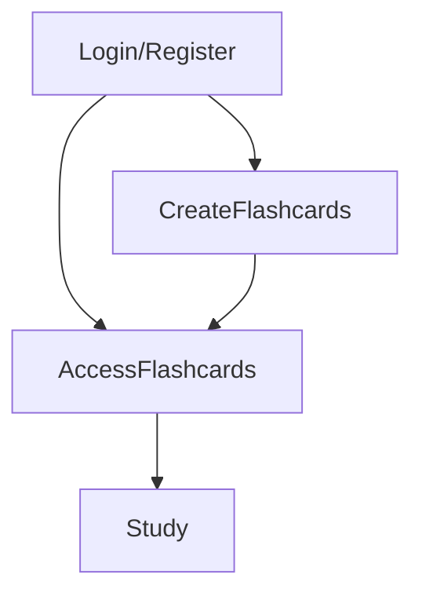

{: .label }
Cennet Kurnaz

{: .no_toc }
# Value proposition

{: .text-delta }

Table of contents

+ ToC
{: toc }

## The problem

Many students struggle with organizing their study materials and maintaining effective study habits. Traditional methods like paper flashcards can be cumbersome and lack the flexibility needed for modern, dynamic learning environments. The problem is especially relevant as learners seek more efficient and interactive ways to study.

## Our solution

Lumen addresses these challenges by providing a digital platform for creating, accessing and studying flashcard sets. The app offers several key features:

- Flashcard Creation and Access: Users can easily create their own flashcards and access them anytime, anywhere.
- Community Sharing: Users can access and study flashcards created by others, fostering a collaborative learning environment.
- Study Mode with Leitner System: Lumen incorporates the Leitner System, a proven study technique, to help users efficiently retain information through spaced repetition.

## Target user

Lumen is designed for:

- Students: From high school to university, students who need an efficient way to study and retain information.
- Educators: Teachers and tutors who want to create and distribute study materials to their students.
- Lifelong Learners: Individuals looking to acquire new knowledge in an organized and effective manner.

Personas:

- Alex, a university student: Needs to study for multiple exams and wants a flexible tool to help with his study sessions.
- Emily, a high school teacher: Wants to create engaging study materials for her students.
- Sophia, a language enthusiast: Loves learning new languages and uses Lumen to create and study vocabulary flashcards efficiently.

## Customer journey

